# ESG Compliance Module User Guide

## Table of Contents
1. [Initial Setup](#initial-setup)
2. [Master Configuration](#master-configuration)
3. [Daily Operations](#daily-operations)
4. [Reports & Analytics](#reports-analytics)

## Initial Setup

### Company Settings
1. Navigate to Company doctype
2. Set ESG related fields:
   - Baseline Emissions (Tonnes CO2e)
   - Baseline Year
   - Annual Emission Reduction Target %
   - Net Zero Target Year
   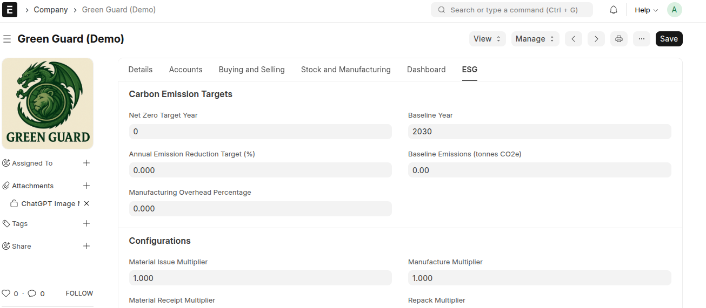

### Item Master Configuration
1. Go to Item doctype
2. Configure ESG fields for each item:
   - Carbon Emission Factor (kg CO2e/unit)
   - Emission Source
   - Carbon Scope (1,2,3)
   - Calculation Method
   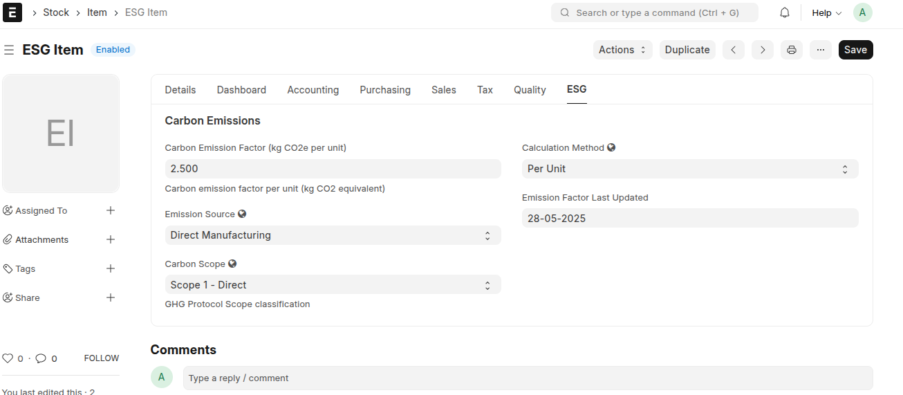

### Customer ESG Profile
1. Access Customer doctype
2. Set sustainability preferences:
   - Carbon Offset Preference
   - Carbon Footprint Reporting Required
   - Sustainability Focus Status
   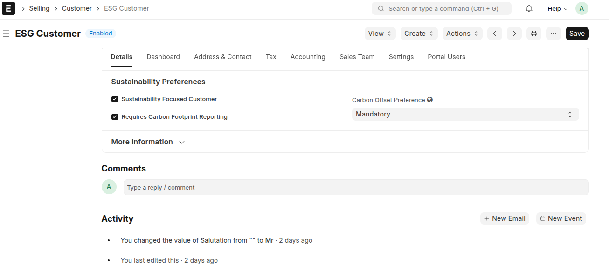

### Supplier Carbon Management
1. Open Supplier doctype
2. Configure carbon credentials:
   - Carbon Certified status
   - Certification Type
   - Certificate Number
   - Certificate Expiry
   - Annual Carbon Emissions
   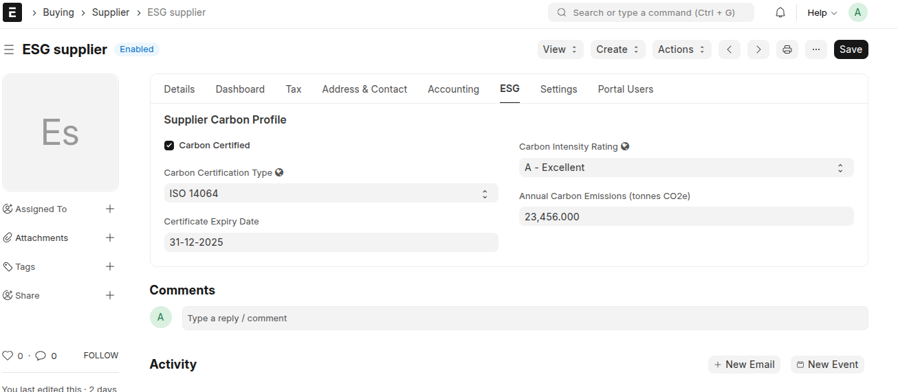

## Daily Operations

### Sales Process
1. Sales Invoice Creation
   - System automatically calculates emissions
   - Shows carbon offset options if enabled
   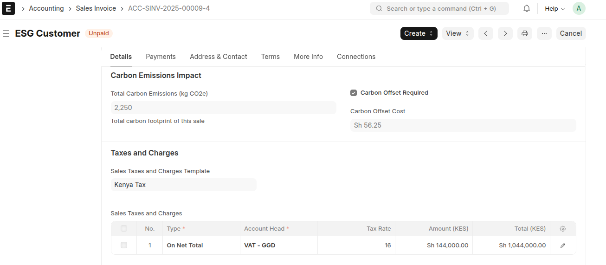

### Purchase Management
1. Purchase Invoice Processing
   - Tracks supplier emissions
   - Validates certification status
   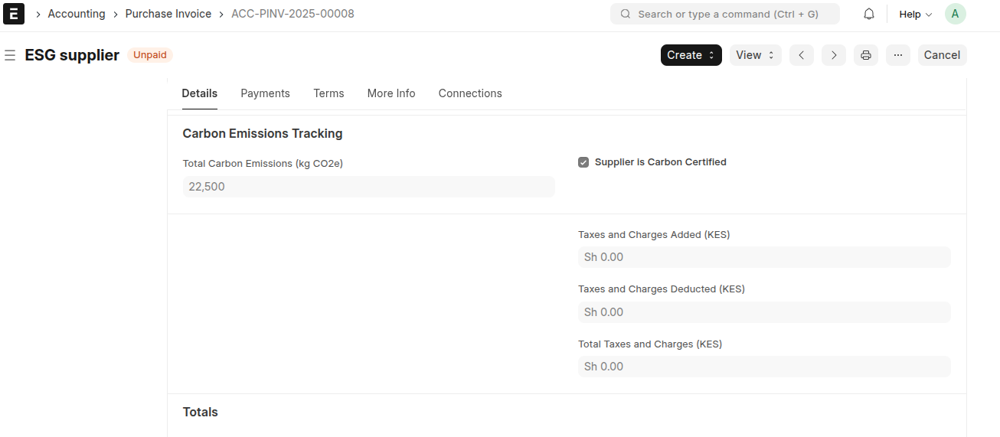

### Manufacturing Operations
1. Work Order Carbon Tracking
   - Raw material emissions
   - Process emissions
   - Total manufacturing impact
   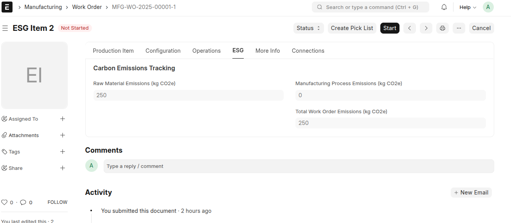

2. Production Planning
   - Emission estimates
   - Carbon reduction targets
   

### Inventory Management
1. Stock Entry Carbon Impact
   - Material receipt impact
   - Transfer emissions
   - Issue carbon tracking
   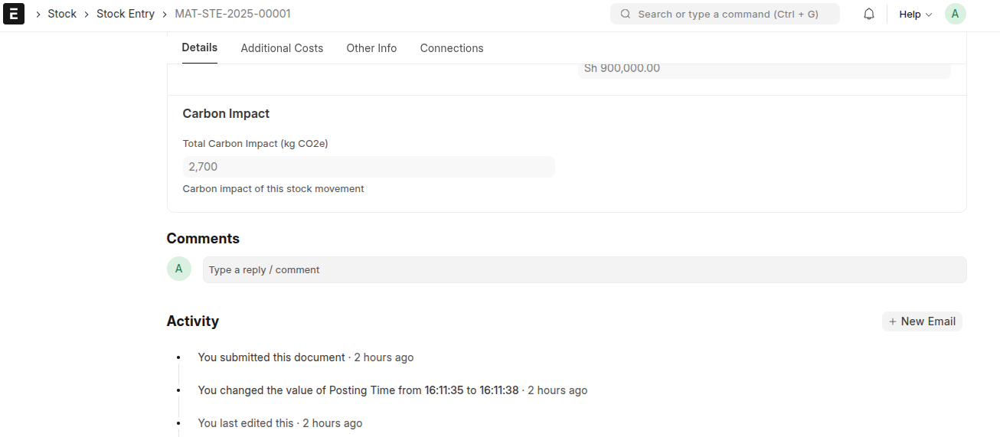

### Delivery Operations
1. Delivery Note Processing
   - Product carbon footprint
   - Transport emissions
   - Total delivery impact
   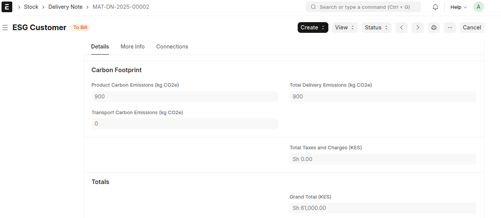

## Reports & Analytics

### ESG Activity Log
1. Comprehensive activity tracking
2. Performance monitoring
3. Verification status
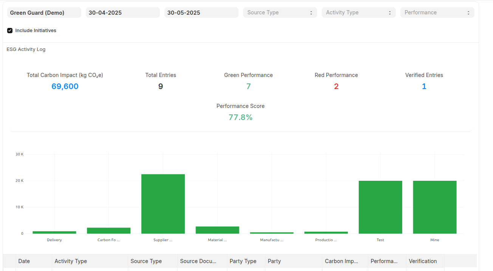

### ESG Analysis Report
1. Metric analysis
2. Target tracking
3. Performance trends
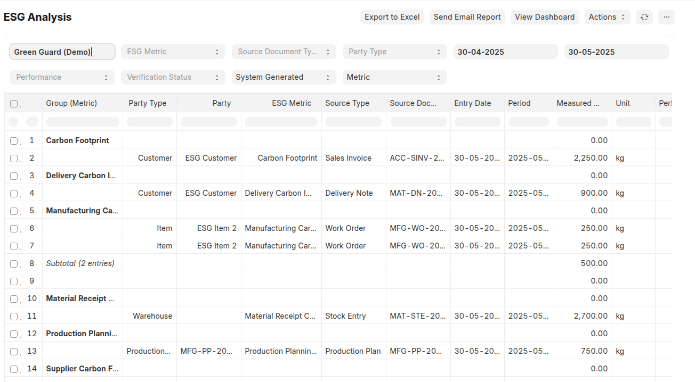

### ESG Overview Dashboard
1. Real-time KPIs
2. Performance charts
3. Initiative tracking
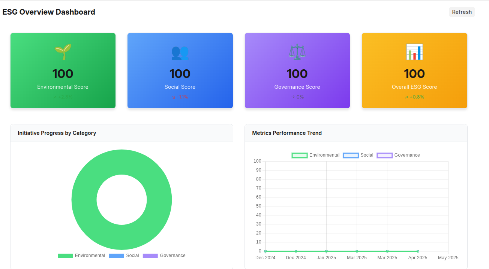

## Tips & Best Practices

1. Regular Updates
   - Keep emission factors current
   - Update certifications before expiry
   - Review targets quarterly

